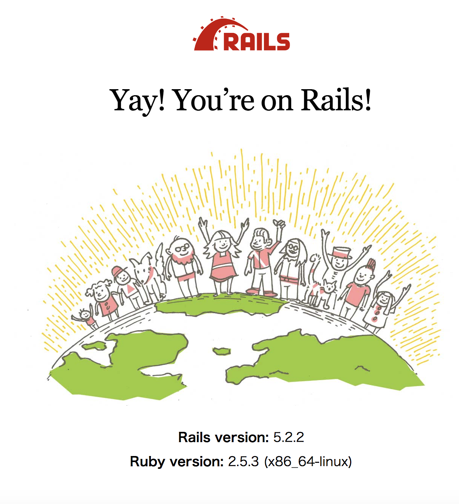

# rails-study-with-docker

Dockerでrailsの環境が入れてあるコンテナを複数構築することで、railsのお勉強を効率的かついい感じに行います。

# Dockerを使ってrailsのお勉強をするために

## Dockerをインストール

公式↓

https://www.docker.com/get-started

## このレポジトリをクローンする

```bash
$ git clone https://github.com/v97ug/rails-study-with-docker.git
```

## docker-composeでコンテナを作成

クローンしたディレクトリに`cd`して、docker-composeでコンテナを作成する。

```bash
$ docker-compose build
$ docker-compose up -d
```

これで、`.env`ファイルに書かれているポート番号（ここでは11190）を使って、http://localhost:11190 にアクセスする。

すると以下の画面が表示されます。



## 他のコンテナを作りたいときは？

ディレクトリごとコピーして、.envファイルのバージョン・2つのポート番号をそれぞれ変えてからコンテナを作成します。

```bash
$ cd ..
$ cp -r rails-study-with-docker rails-study-with-docker2
$ cd rails-study-with-docker2
$ docker-compose build
$ docker-compose up -d
```

これで先ほどとは別のコンテナが立ち上がります。

## 参考

https://qiita.com/reflet/items/efb624996f8876f8167e
